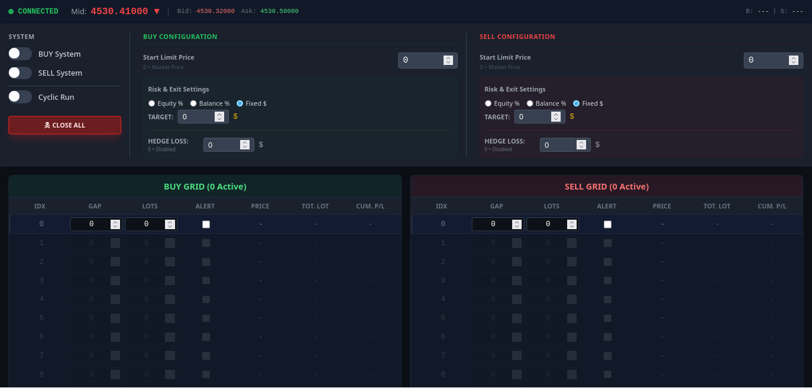

# Elastic DCA Trading System


**A professional-grade, full-stack algorithmic trading engine designed for mean-reversion and counter-trend strategies on MetaTrader 5.**



## 📉 What is Elastic DCA?

The **Elastic DCA (Dollar Cost Averaging)** system is an advanced automation tool for traders who capitalize on market volatility. Unlike simple grid bots that blindly place orders, this system treats price movement like an elastic band:

1.  **The Stretch (Accumulation):** As the price moves against your entry, the system intelligently places DCA orders at specific "Gap" intervals (Strata). This improves your average entry price.
2.  **The Snap-Back (Profit):** The system calculates a "Basket Take Profit." It doesn't need the price to return to the start; it only needs a minor reversal (recoil) to close all positions in net profit.
3.  **The Lock (Safety):** If the market stretches too far without snapping back, the integrated **Hedge Monitor** instantly opens a counter-trade to "lock" your drawdown, buying you time to manage the situation without blowing the account.

---

## 🚀 Key Features

### 🧠 Intelligent Core

- **Decoupled Logic:** Trading logic runs on a standalone Python server (FastAPI), not inside MT5. This ensures state preservation even if the terminal crashes.
- **Session Management:** Supports "One-Shot" (sniper mode) or "Cyclic" (continuous loop) trading sessions.
- **Conflict Resolution:** Uses UUID hashing to track specific trades, preventing interference with other EAs running on the same account.

### 🛡️ Risk Management (The "IronClad" Protocol)

- **Basket Take Profit:** Closes the entire grid based on Equity % Gain, Balance % Gain, or Fixed Dollar Amount.
- **Automated Hedge Lock:** The system monitors real-time PnL. If a grid session hits a specific loss threshold (e.g., -$500), it automatically executes a hedging order to freeze the floating loss.
- **Emergency Controls:** A "Close All" panic button and manual external close detection (if you close trades on your phone, the server recognizes it).

### 🖥️ Modern Command Center

- **React-Based UI:** A dark-mode, high-performance dashboard to visualize your grid levels, invalid rows, and current market state.
- **Audio Alerts:** Audible notifications when levels are executed, ensuring you never miss a grid expansion.
- **Dynamic Configuration:** Adjust grid gaps, lot sizes, and TP settings on the fly without stopping the bot.

---

## 📂 Project Structure

The system follows a monorepo-style architecture separating logic, interface, and infrastructure.

```text
elastic-dca-system/
├── apps/
│   ├── server/          # Python FastAPI State Engine
│   └── web/             # React/Vite Control Dashboard
├── scripts/
│   └── automation.mt5   # MQL5 Client Bridge
├── docs/                # Technical API & Deployment Guides
├── infra/               # AWS Setup & SSH Keys
└── images/              # Assets
```

---

## ⚡ Getting Started

### Prerequisites

1.  **MetaTrader 5 Terminal** installed and logged into a broker.
2.  **Python 3.9+** installed on the host machine.
3.  **Node.js & NPM** (for the UI).

### Step 1: Server Setup

The server acts as the brain. It must be running before the MT5 script.

```bash
# 1. Navigate to the server application
cd apps/server

# 2. Install Python dependencies
pip install -r requirements.txt

# 3. Start the engine
python main.py
```

_The server will start on `http://0.0.0.0:8000`._

### Step 2: Dashboard Setup

Launch the visual control panel.

```bash
# 1. Open a new terminal and navigate to the web application
cd apps/web

# 2. Install Node dependencies
npm install

# 3. Start the UI
npm run dev
```

_Access the dashboard at `http://localhost:3000`._

### Step 3: MetaTrader 5 Bridge

1.  Open MetaTrader 5.
2.  Go to **Tools -> Options -> Expert Advisors**.
3.  Check **"Allow WebRequest for listed URL"**.
4.  Add your server URL: `http://127.0.0.1:8000` (or your VPS IP).
5.  Locate the script in this repo at: `scripts/automation.mt5`.
6.  Copy `automation.mt5` to your MT5 Data Folder: `MQL5/Experts/`.
7.  Drag the script onto the chart of the symbol you wish to trade (e.g., XAUUSD).

---

## 🕹️ How to Use (Trader's Workflow)

### 1. Configuration Phase

Open the Dashboard. Define your "Strata" (Grid Rows) for Buy and Sell sides.

- **Gap ($):** How far the price must move from the previous order to trigger this level.
- **Lots:** The volume size for this level.
- **Alert:** Check this if you want an audio ping when this specific level fills.

### 2. Strategy Setup

Set your exit and safety parameters:

- **Take Profit:** Recommended `Equity %` (e.g., 0.5% of account) or `Fixed $` (e.g., $100).
- **Hedge Trigger:** The dollar amount of loss (e.g., $500) at which the system acts to protect the account.

### 3. Execution

- **Manual Start:** Toggle "Buy System" or "Sell System" ON. The system will place the first trade immediately (Index 0) or wait for a Limit Price if configured.
- **Monitor:** Watch the "Active Levels" on the dashboard. As the market moves, the system will fill the defined rows.
- **Completion:** Once the Basket TP is hit, the system closes all trades, resets the logic, and (if Cyclic mode is ON) starts a fresh session.

---

## 📚 Documentation

For developers looking to extend the functionality:

- **API Reference:** See [docs/api/api_technical_reference.md](docs/api/api_technical_reference.md) for JSON payloads and endpoints.
- **Deployment:** See [infra/aws/aws_setup.md](infra/aws/aws_setup.md) for running this on the cloud.

---

## ⚠️ Risk Disclaimer

**Trading foreign exchange and CFDs on margin carries a high level of risk and may not be suitable for all investors.**

The **Elastic DCA** strategy involves adding to losing positions (averaging down). While this increases the probability of a profitable exit during ranging markets, it can lead to significant drawdown during strong trending markets if the "Hedge" safety features are not configured correctly.

- Always test on a **Demo Account** first.
- Ensure your `Hedge Loss` settings are compatible with your account margin.
- The developers are not responsible for financial losses incurred while using this software.

---

## 🤝 Contributing

We welcome contributions from the algorithmic trading community.

1.  Fork the Project
2.  Create your Feature Branch (`git checkout -b feature/AmazingFeature`)
3.  Commit your Changes (`git commit -m 'Add some AmazingFeature'`)
4.  Push to the Branch (`git push origin feature/AmazingFeature`)
5.  Open a Pull Request

## 📄 License

Distributed under the MIT License. See `LICENSE` for more information.
